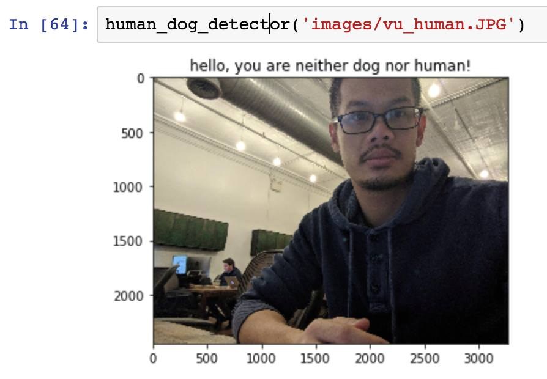

    

 

I enjoy being challenged and engaging with projects that require me to work outside my comfort and knowledge set. I am continually learning new technologies, concepts, and frameworks. 

Most recently, I completed Udacity's Artificial Intelligence Nanodegree because I believe that human beings can benefit greatly from AI's exciting revival. As part of the program requirement, I implemented projects ranging from the classic game-playing or planning agents to contemporary deep learning models such as Convolution Neural Network, Recurrent Neural Network, and Long-Short Term Memory Network.

I am also very interested in the recent development of web-based applications (MVC, Rails, Django, JavaScript, React, etc.) I am learning React/Redux for the front-end, and Django for the back-end. I am working on a few small projects to hone my skills in these areas.

Languages, Libraries, and Frameworks:
* Comfortable with: Python, JavaScript, Java, Mathematics, English, Vietnamese
* Have had used before: AngularJS, C++, C#, French, Mathematica, MATLAB, MySQL, OCaml, Perl, PostgresSQL, Spark, VBA
* Currently learning: ES6, Node.js, React, Redux, Django