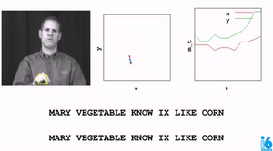

    

        <b>Facial Keypoints Detection and Filter Application - 3/2018</b> 
    

    

        
    

    

        Udacity's Capstone Project in Computer Vision. CV pipeline that performs Facial Keypoint Recognition on images and applies filters (such as sunglasses) in real-time via webcam.
    

    

        <b>Dog Breed Detection with Transfer CNN Learning - 1/2018</b>
    

    

        
    

    

         Utilizing Haar Cascades for human face detection. Dog images then go through a CNN model (via transfer learning) to identify the subject's breed.
    

    

        <b>American Sign Language Recognizer - 10/2017</b>
    

    

        
    

    

         Trained a set of Hidden Markov Models to recognize words communicated using the American Sign Language on preprocessed dataset of tracked hand and nose positions provided by Udacity.
    

    

        <b>AI Wargame - 4/2015</b>
    

    

        
    

    

         One of CS440's many AI projects, I use HTML and JavaScript to give it a front-end, improving user-friendliness (this is rare as I usually program for console). AI includes Minimax, Alpha-beta Pruning. The goal is to earn as many points as possible.
    

    

        <b>Tetris - 7/2014</b>
    

    

        
    

    

         The famous game of Tetris, was done with HTML5 canvas, JavaScript, jQuery. I was interested in learning the new JavaScript so I did this. The last time I used JavaScript (2001-2006), it involved making marquee I.E. status bar, snowing effects, and form validations. So this was an eye-opening reintroduction.
    

    

        <b>Memory - 6/2014</b>
    

    

        
    

    

         Simple game to improve your memory, was done with HTML and some JavaScript. This was one of the exercise in my NYU Advanced JavaScript class.
    

<a href="#top">Back to Top</a>